# Sakarya University Pediatrics Website

A **responsive Pediatrics Department web project** developed as a course project.  
The site provides information about the hospital, staff, schedules, announcements, and interactive features such as quizzes and emergency notifications.  
**Fully responsive:** Works seamlessly on both desktop and mobile devices.

---

## Features
- **Homepage:** Announcements, success stories, and about section.
- **Hospital Introduction:** Detailed information about the hospital and its facilities.
- **Staff List:** Assistant doctors and faculty members.
- **Duty Schedule:** On-call calendar for doctors.
- **Quiz:** Interactive quiz section for knowledge testing.
- **Announcements:** Latest news and updates.
- **Emergency Notifications:** Dynamic section for urgent alerts.

---

## Tech Stack
- **HTML5 / CSS3 / JavaScript**
- **Responsive Design (Desktop & Mobile)**

---

## Screenshots

### Desktop Views
#### Homepage
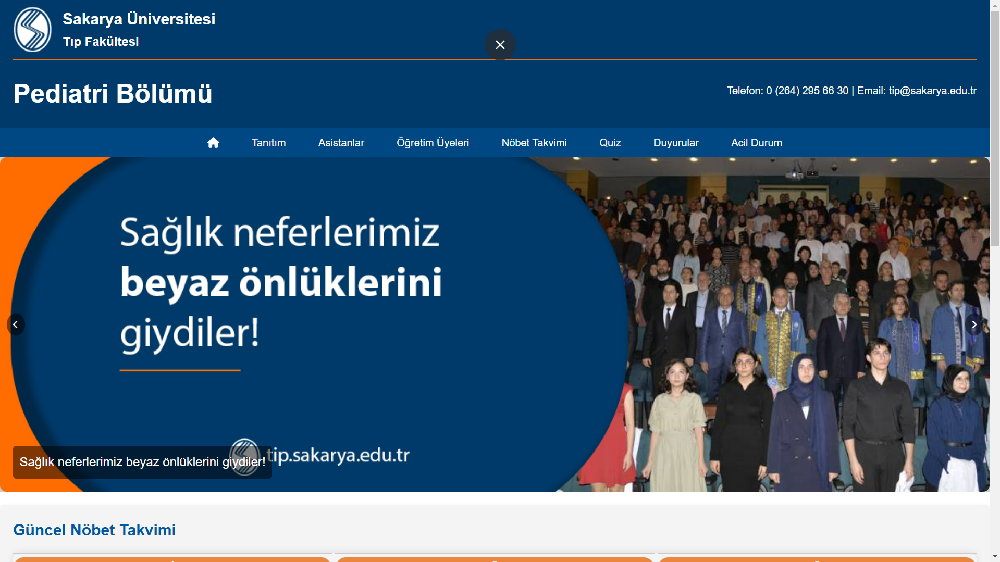
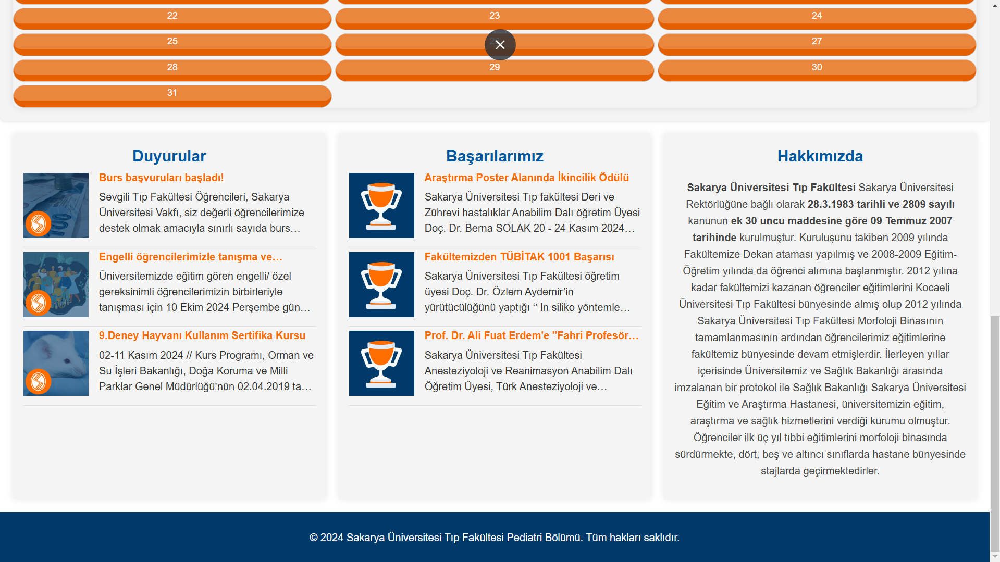

#### Introduction Page
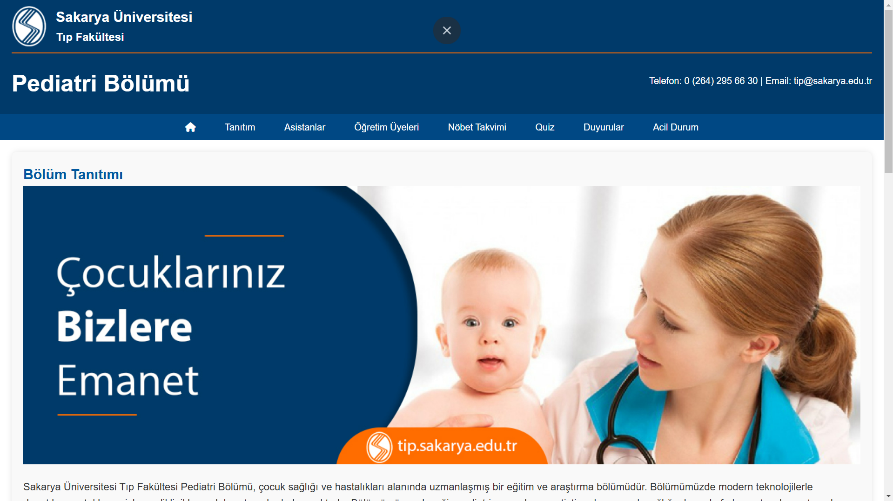

#### Assistants
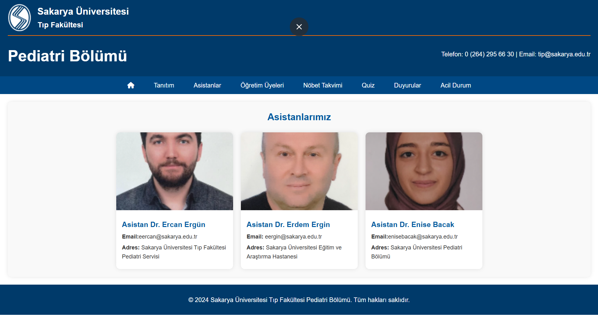

#### Faculty Members
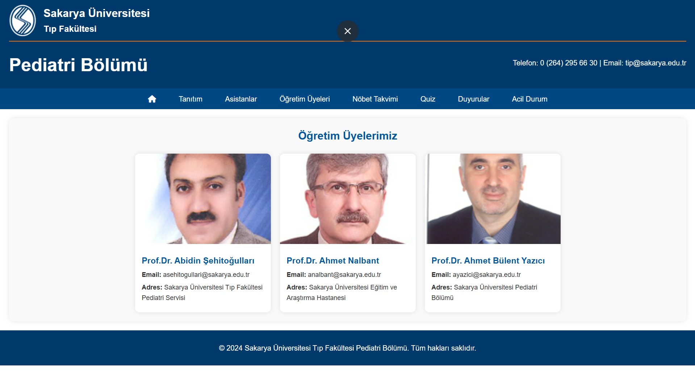

#### Duty Schedule
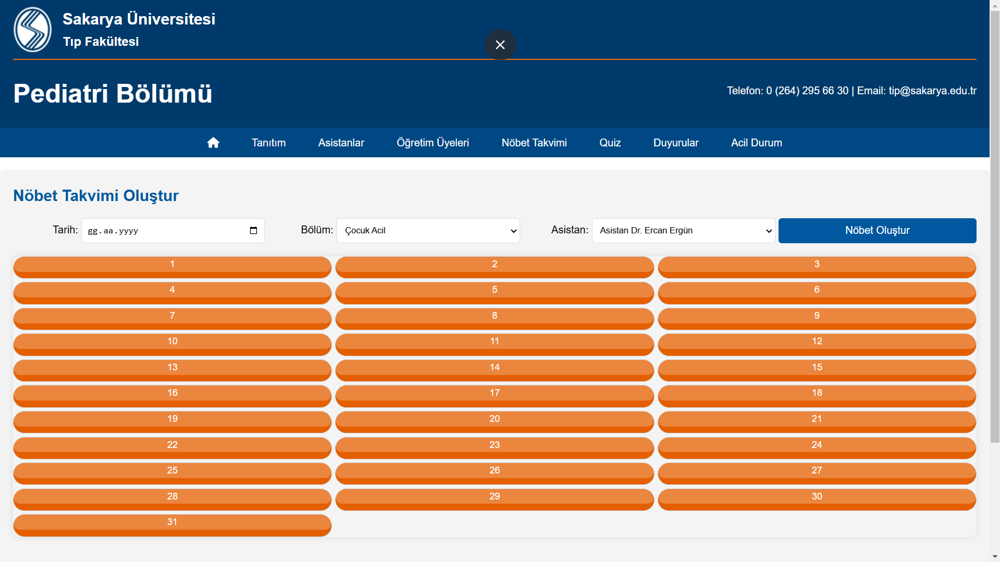
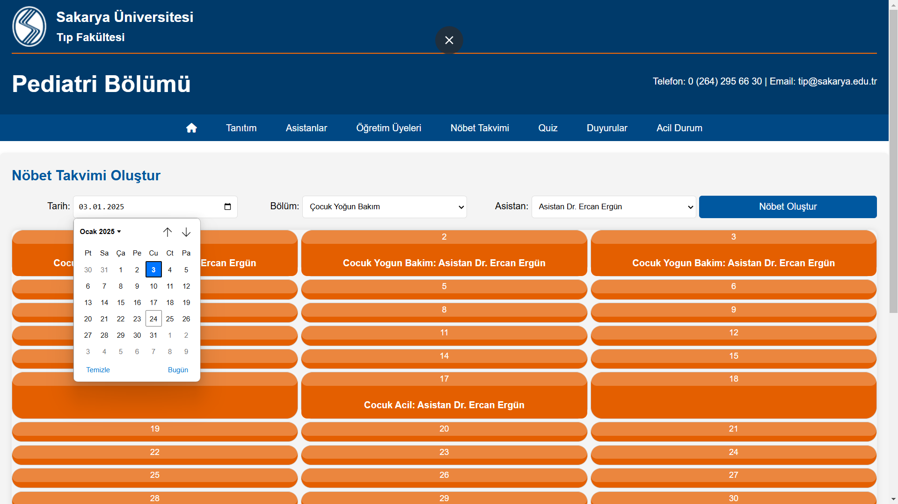
#### Quiz
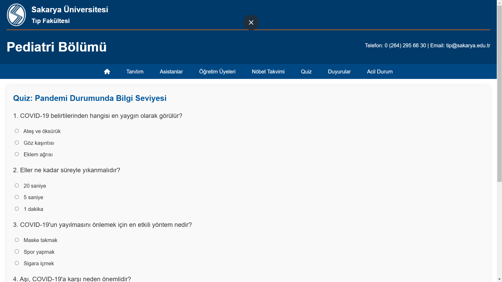

#### Announcements
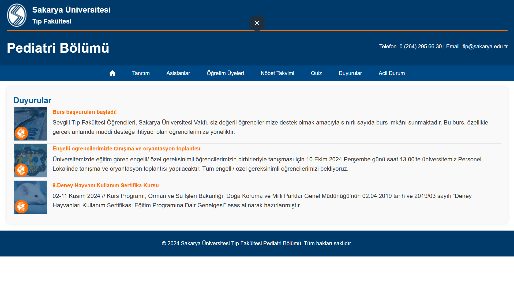

#### Emergency Alerts
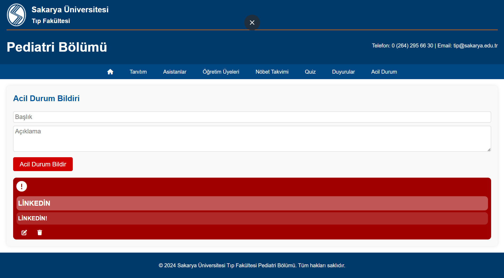

### Mobile Views
#### Homepage (Mobile)
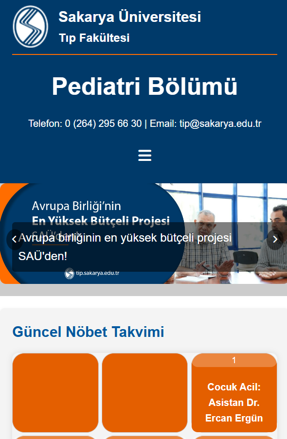

*(Add other mobile screenshots as needed)*

---

## Usage
1. Clone the repository:
   ```bash
   git clone https://github.com/furkanaktrk/pediatrics.git
2. Open
  index.html in your browser.
